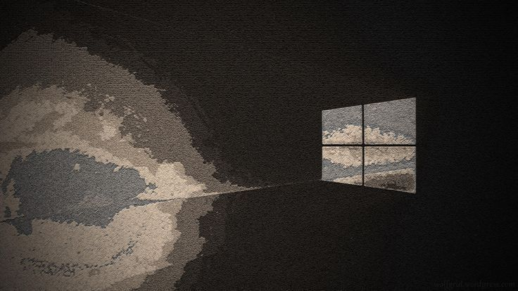

  

  
  
  
  
  

 

<h2 align="center">  <em>About  me </em></h2>

 

  Hello There! I'm <b>Jeet</b>, an aspiring <b>AI/ML Engineer</b> focused on building <b>production-ready machine learning systems</b>.
I work on end-to-end ML pipelines — from data ingestion and feature engineering to model training, deployment, and monitoring. My focus is on solving real-world problems using AI, especially in areas like <b>CI/CD optimization, anomaly detection, and log intelligence</b>.
Currently, I am building scalable ML systems with an emphasis on <b>performance, reliability, and real-world impact</b>.

 

 <em><b>Focused on AI/ML Engineering & System Design</b></em>  
 <em><b>Building production-grade ML systems & APIs</b></em> 
 <em><b>Working on real-world projects (CI/CD ML, Log Intelligence)</b></em> 
 <em><b>Continuously learning advanced ML & scalable architectures</b></em> 

 
 
<h2 align="center">  <em> Technologies </em> </h2>

  

 

<h2 align="center"">  <em> Statistics </em> </h2>

 

